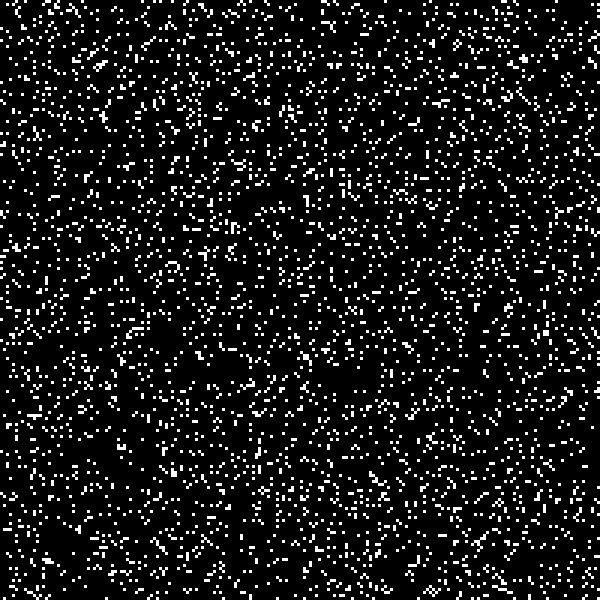

# Conway’s Game of Life

[]()
[]()

This project implements **Conway’s Game of Life** in C.  
The program simulates cellular automata on a grid and outputs each step as **PBM image files** (portable bitmap), which can be compiled into a **GIF animation** (`gol.gif`) to visualize the simulation.

---

## 

---

## Overview

Conway’s Game of Life is a zero-player game where the grid evolves based on simple rules:

1. A live cell with fewer than 2 live neighbors dies (underpopulation).
2. A live cell with 2 or 3 live neighbors survives.
3. A live cell with more than 3 live neighbors dies (overpopulation).
4. A dead cell with exactly 3 live neighbors becomes a live cell (birth).

This implementation:

- Generates a **random initial state** based on a user-defined density.
- Evolves the grid for a specified number of steps.
- Outputs each generation as a **PBM image file** (e.g., `gol_00001.pbm`, `gol_00002.pbm`, ...).
- Can be combined into an animated **GIF** (e.g., `gol.gif`) for visualization.

---

## Usage

### Compilation

Compile the C program:

```bash
gcc -o game game.c
./game <width> <height> <density> <steps>
Example: ./game 100 100 0.3 50
```

### Output

**PBM Images**: Each generation is saved as gol_00001.pbm, gol_00002.pbm, etc.
**GIF Animation**: Combine PBM files into a GIF using [ImageMagick](https://imagemagick.org/index.php):

```bash
convert -delay 10 -loop 0 gol_*.pbm gol.gif
```
